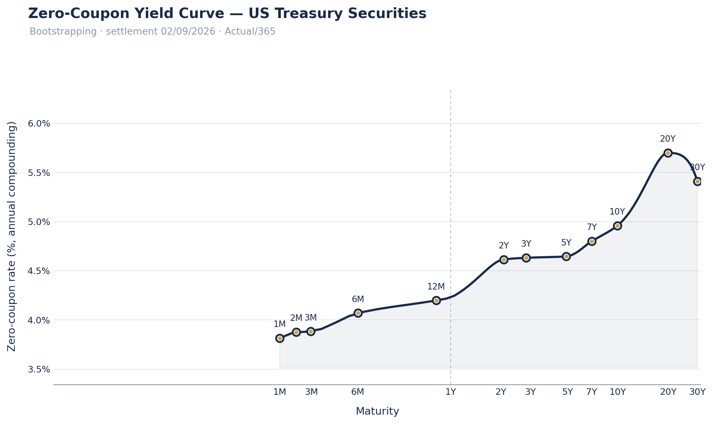
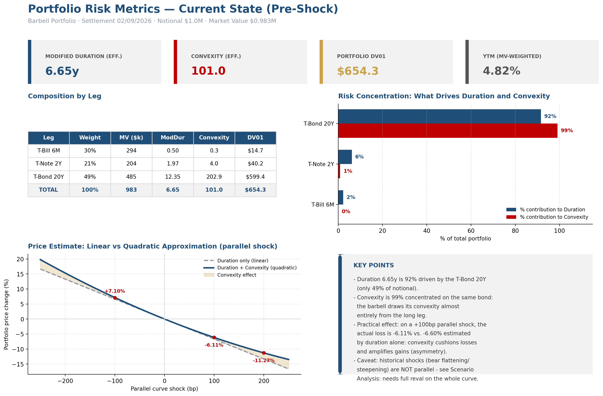
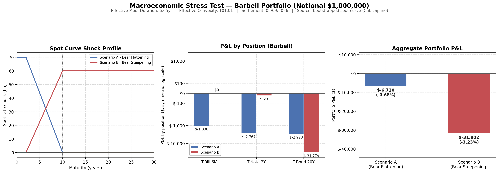
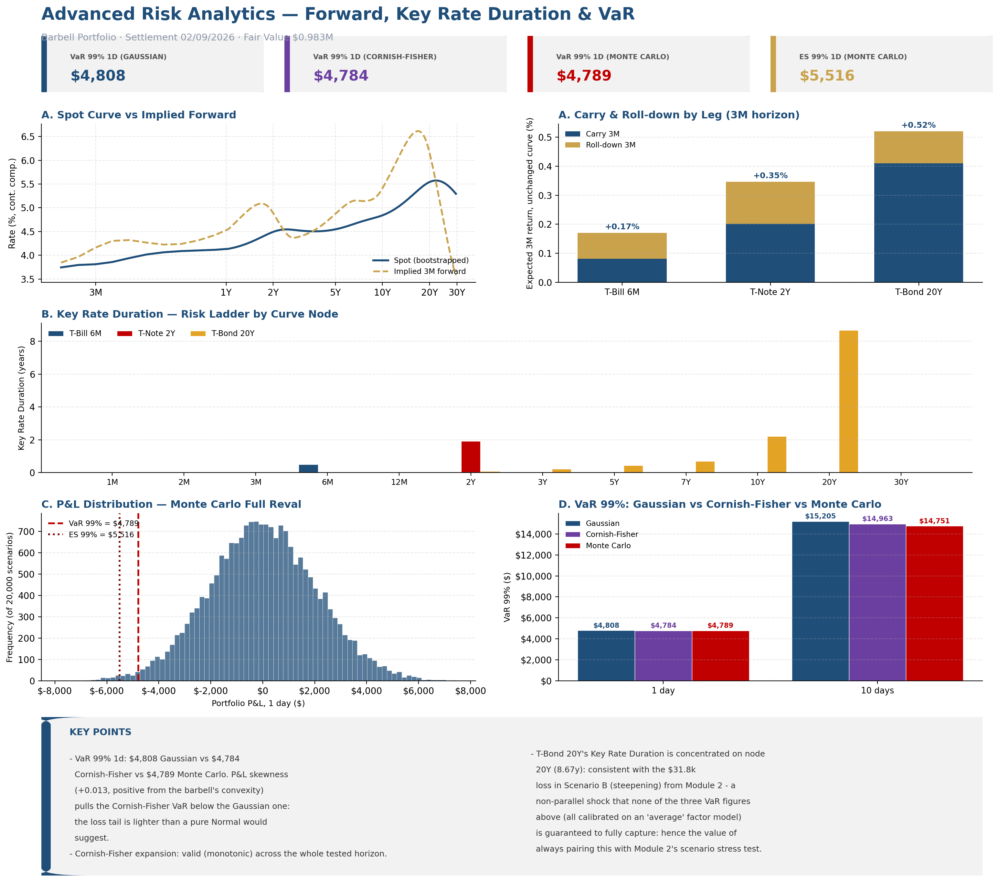

```{=latex}
\begin{titlepage}
\thispagestyle{empty}
\begin{center}
\vspace*{2.2cm}
{\footnotesize\color{midgrey}\textsc{Fixed Income \; $\cdot$ \; Quantitative Research Project}}\\[1.6cm]
{\color{navy}\fontsize{27}{32}\selectfont\bfseries Fixed Income Portfolio\\[0.15cm] Risk Analytics}\\[0.7cm]
{\color{gold}\rule{7.5cm}{1.6pt}}\\[0.9cm]
{\Large\color{navy!85} Technical Report}\\[0.5cm]
{\large\itshape\color{midgrey} A zero-coupon curve bootstrap and multi-methodology\\ risk framework for a US Treasury barbell portfolio}
\vspace{1.6cm}

{\small\color{navy}\textbf{Antonio Polito} \quad $\cdot$ \quad \textbf{Stefano Troiano}}\\[0.15cm]
{\footnotesize\href{mailto:antoniopolito09@gmail.com}{antoniopolito09@gmail.com} \quad $\cdot$ \quad \href{mailto:stefanot841@gmail.com}{stefanot841@gmail.com}}\\[0.3cm]
{\footnotesize\itshape\color{midgrey} Università degli Studi di Napoli Federico II}
\vfill
\begin{tabular}{r l}
\color{midgrey}\footnotesize PORTFOLIO & \footnotesize \$1{,}000{,}000 notional barbell --- T-Bill 6M / T-Note 2Y / T-Bond 20Y \\[2pt]
\color{midgrey}\footnotesize SETTLEMENT DATE & \footnotesize September 2, 2026 \\[2pt]
\color{midgrey}\footnotesize SCOPE & \footnotesize Curve construction $\cdot$ pricing $\cdot$ risk $\cdot$ stress testing $\cdot$ VaR/ES $\cdot$ market read \\
\end{tabular}\\[1.4cm]
{\footnotesize\color{midgrey} Prepared as a self-contained technical deliverable --- methodology, code, and results reconciled end to end.}
\vspace*{1.4cm}
\end{center}
\end{titlepage}
\pagenumbering{roman}
\tableofcontents
\clearpage
\pagenumbering{arabic}
\setcounter{page}{1}
```

> **Scope of this document.** This report covers the full pipeline built for this project: curve construction, pricing, risk metrics, stress testing, advanced analytics (forward curve, Key Rate Duration, VaR/ES), and — as of this revision — the **historical calibration** of the factor volatilities that feed the VaR framework (§4.3.1), plus a closing **interpretive read** (§9) that puts the numbers next to the actual September 2026 rates backdrop. Earlier drafts of this document scoped the interpretive layer out as a "subsequent deliverable"; it is folded in here once the quantitative layer was solid enough to say something about the market with it, rather than around it.

---

## 1. Project Overview

| | |
|---|---|
| **Objective** | Build an institutional-grade, end-to-end fixed income risk pipeline: from raw market quotes to a fully reconciled VaR framework, on a single self-consistent curve. |
| **Universe** | 12 on-the-run US Treasury securities (5 T-Bills, 5 T-Notes, 2 T-Bonds) |
| **Data source** | WSJ market snapshot (Bonds/Bills quote page) |
| **Settlement / valuation date** | September 2, 2026 |
| **Portfolio** | $1,000,000 notional barbell — T-Bill 6M / T-Note 2Y / T-Bond 20Y |
| **Language / stack** | Python 3 — `numpy`, `pandas`, `scipy`, `matplotlib`, `python-dateutil` |
| **Structure** | 3 sequential, independently runnable modules (Sections 2–4 below) |

The project is designed to mirror what a **fixed income risk / portfolio analytics desk** would build as a first internal tool: a single bootstrapped curve feeding one consistent pricing function, from which *every* downstream risk metric (duration, convexity, DV01, KRD, VaR) is derived by **full re-pricing**, never by a separate closed-form shortcut. This "one curve, one pricer, many risk lenses" design is the central methodological choice of the project and is what allows every metric to be cross-checked against every other (Section 5).

---

## 2. Module 1 — Zero-Coupon Curve Bootstrap

**File:** `src/bootstrap_yield_curve.py`

### 2.1 Input nodes

Twelve market quotes, selected directly from the WSJ snapshot (yellow-highlighted cells in the source workbook):

| Security | Maturity | Coupon | Price | Freq |
|---|---|---|---|---|
| T-Bill 1M | 2026-10-01 | — | 99.703 | 0 |
| T-Bill 2M | 2026-11-03 | — | 99.356 | 0 |
| T-Bill 3M | 2026-12-01 | — | 99.065 | 0 |
| T-Bill 6M | 2027-03-04 | — | 98.020 | 0 |
| T-Bill 12M | 2027-08-05 | — | 96.274 | 0 |
| T-Note 2Y | 2028-09-30 | 4.625% | 100.135 | 2 |
| T-Note 3Y | 2029-06-30 | 4.250% | 99.145 | 2 |
| T-Note 5Y | 2031-07-31 | 4.375% | 99.065 | 2 |
| T-Note 7Y | 2033-08-31 | 4.500% | 98.657 | 2 |
| T-Note 10Y | 2036-08-15 | 4.625% | 98.204 | 2 |
| T-Bond 20Y | 2046-08-15 | 5.125% | 98.060 | 2 |
| T-Bond 30Y | 2056-08-15 | 5.125% | 97.270 | 2 |

T-Bills quote **clean price**; T-Notes/T-Bonds quote **mid price** and require accrued interest to obtain the dirty price used in the bootstrap.

### 2.2 Day-count and accrual conventions

Two distinct conventions are used deliberately for two distinct purposes:

- **Curve time axis → Actual/365 (fixed).** `year_frac_act365(d0, d1) = (d1 - d0).days / 365`. Used for every zero rate, discount factor, and duration/DV01 calculation across the whole project.
- **Accrued interest → Actual/Actual (ICMA), semi-annual.** The coupon schedule is built *backwards* from maturity in 6-month steps (`coupon_schedule()`), and accrued interest is:

```
AI = (FaceValue × coupon / freq) × (accrued_days / period_days)
```

This ICMA basis (rather than a flat Act/365 accrual) is the correct market convention for US Treasury coupon securities and was cross-validated against an independent implementation — both converge numerically once the underlying day-count is aligned, confirming the accrual logic is basis-point-accurate for a settlement date that does not fall on a coupon date.

### 2.3 Bootstrap algorithm

The curve is built **iteratively, in maturity order**, using only information already stripped:

**Step 1 — Bills (zero-coupon).** A single cash flow at maturity ⇒ the discount factor is read directly off the price:

```
DF(T) = Price / 100
```

**Step 2 — Notes/Bonds (coupon-bearing).** For each security:
1. Compute accrued interest (§2.2) and form the dirty price: `DirtyPrice = CleanPrice + AI`
2. Build the future coupon schedule from settlement to maturity
3. Discount every coupon **except the last** using the curve already bootstrapped up to that point (`curve.discount_factor`, linear interpolation on zero rates between existing nodes — see §2.4)
4. The **final cash flow** (last coupon + redemption) is used to solve for the new discount factor as the residual:

```
DF(T_new) = [DirtyPrice − PV(interim coupons)] / (LastCoupon + FaceValue)
```

5. This new `(T, DF)` pair is added to the discrete curve before moving to the next (longer) security.

This is the standard **sequential bootstrap / stripping** method: every node uses only shorter-maturity information, so there is no simultaneous system to solve and no numerical root-finding required for the curve itself (Newton-Raphson is reserved for the *separate*, purely descriptive single-bond YTM calculation in Module 2 — see §3.3).

### 2.4 Two curve representations, used for two different purposes

The project deliberately keeps **two curve objects**, each fit for its own step:

| Object | Interpolation | Extrapolation | Used for |
|---|---|---|---|
| `_BootstrapCurve` (discrete, internal) | **Linear on the continuously-compounded zero rate** between bootstrapped nodes | Flat on the last zero rate | Discounting interim coupons *during* the bootstrap itself |
| `ContinuousCurve` (final, exported) | **Natural cubic spline** (`scipy.interpolate.CubicSpline`, `bc_type="natural"`) fitted on the 12 bootstrapped zero rates | Flat outside `[t_min, t_max]` | All downstream pricing, risk, and shock analysis in Modules 2–3 |

Using a simple linear interpolant *inside* the bootstrap avoids any circularity (each new node depends only on a curve whose shape near that node is not yet influenced by it), while the smoother cubic spline is preferred for the *final* curve because kinks in the zero curve would translate into artificial jumps in forward rates and Key Rate Duration (Module 3). The spline's natural boundary condition (zero second derivative at the two ends) avoids the extra oscillation that a fully unconstrained cubic spline can introduce at the short and long end.

**Zero rate convention:** continuously compounded, `DF(t) = exp(-z(t)·t)`. All rates in the tables below are also reported in annually-compounded terms (`(e^z − 1)`) as this is the more standard market-quoting convention for readability.

### 2.5 Bootstrapped curve — results

| Security | T (yrs, Act/365) | Discount Factor | Zero rate, cont. comp. (%) | Zero rate, annual comp. (%) |
|---|---:|---:|---:|---:|
| T-Bill 1M | 0.0795 | 0.997030 | 3.744 | 3.815 |
| T-Bill 2M | 0.1699 | 0.993560 | 3.804 | 3.877 |
| T-Bill 3M | 0.2466 | 0.990650 | 3.810 | 3.883 |
| T-Bill 6M | 0.5014 | 0.980200 | 3.989 | 4.069 |
| T-Bill 12M | 0.9233 | 0.962740 | 4.113 | 4.198 |
| T-Note 2Y | 2.0795 | 0.910446 | 4.512 | 4.615 |
| T-Note 3Y | 2.8274 | 0.879840 | 4.528 | 4.632 |
| T-Note 5Y | 4.9123 | 0.800039 | 4.542 | 4.646 |
| T-Note 7Y | 7.0000 | 0.720183 | 4.689 | 4.801 |
| T-Note 10Y | 9.9589 | 0.617577 | 4.839 | 4.958 |
| T-Bond 20Y | 19.9644 | 0.330720 | 5.542 | 5.699 |
| T-Bond 30Y | 29.9726 | 0.206206 | 5.268 | 5.409 |

*(full precision in `output/data/yield_curve_bootstrap.csv`)*

{width=16cm}

**Shape.** The curve is upward sloping from the front end (~3.8%) through the belly, steepens noticeably between 10Y and 20Y, peaks at the 20Y node (5.70%), and then **inverts between 20Y and 30Y** (5.70% → 5.41%). This 20Y/30Y inversion is not a modeling artifact: it is present directly in the two input market prices (98.060 vs 97.270 clean, for very similar coupons) and survives untouched by the bootstrap and by the interpolation choice, since both are nodes with directly observed prices. It is the single most consequential feature of the curve for the rest of the project (§3.1) and is flagged here purely as a technical observation — its macro interpretation (term premium, supply/demand at the very long end) is deferred to the interpretive phase.

---

## 3. Module 2 — Portfolio Construction, Pricing & Stress Testing

**File:** `src/portfolio_risk_stress_test.py`

### 3.1 Portfolio construction — barbell design

| Leg | Role | Weight | Face ($) |
|---|---|---:|---:|
| T-Bill 6M | Liquidity / short end | 30% | 300,000 |
| T-Note 2Y | Fed-sensitive / belly | 20% | 200,000 |
| T-Bond 20Y | Duration & convexity / long end | 50% | 500,000 |
| **Total** | | **100%** | **1,000,000** |

**Design rationale, stated explicitly as a modeling choice:** a barbell concentrates weight at the two ends of the curve and *deliberately underweights the belly*, in order to source portfolio convexity almost entirely from the long leg while keeping duration moderate via the large short-end allocation. The **T-Bond 20Y** (rather than 30Y) was chosen as the long leg specifically because it is the node carrying the steepest observed term premium on the bootstrapped curve (§2.5) — i.e. it is the leg with the most convexity per dollar of duration available in this dataset. This is a decision documented in the code comments and reconciled against earlier draft versions of the project that had inconsistently used the 30Y bond.

### 3.2 Pricing — cash-flow mapping on the bootstrapped curve

Every position is priced by **discounting its actual remaining cash flows off the continuous spot curve** — there is no separate "bond pricing formula" with its own yield; the fair value is a direct application of the curve built in Module 1:

```
Price_100 = Σ  CF_i × DF(t_i)          (per 100 face, DF from ContinuousCurve)
FairValue = Price_100 × Face / 100
```

| Leg | Face | Price /100 | Fair Value | Weight (MV) | YTM |
|---|---:|---:|---:|---:|---:|
| T-Bill 6M | $300,000 | 98.020 | $294,060.00 | 29.90% | 4.069% |
| T-Note 2Y | $200,000 | 102.087 | $204,173.72 | 20.76% | 4.552% |
| T-Bond 20Y | $500,000 | 97.046 | $485,229.87 | 49.34% | 5.385% |
| **Portfolio** | **$1,000,000** | — | **$983,463.59** | **100%** | **4.75%** (MV-weighted) |

Market value ($983,463.59) is below par notional ($1,000,000), consistent with an upward-sloping curve at yields above the securities' coupons for the 2Y and 20Y legs.

### 3.3 Risk metrics — effective (full re-pricing), not analytical

This is the key methodological decision of the project: **Modified Duration, Convexity and DV01 are computed by full re-pricing the position on a parallel ±1bp shift of the *entire spot curve*** (`effective_risk_metrics()`), not from a closed-form Macaulay-duration formula on a single YTM:

```
DV01       = [P(-1bp) − P(+1bp)] / 2
ModDur_eff = [P(-1bp) − P(+1bp)] / (2 · P0 · Δy)
Conv_eff   = [P(+1bp) + P(-1bp) − 2·P0] / (P0 · Δy²)          Δy = 1bp
```

**Why not the closed-form YTM-based duration.** A single-yield Macaulay/modified duration is only well-defined when every cash flow of a bond is discounted at the *same* rate. On this project's multi-maturity spot curve, each cash flow of, say, the T-Bond 20Y is properly discounted at a different point on the curve (its own coupon dates), so a single "YTM" for the bond is itself an aggregate, second-order statistic — computing duration by differentiating with respect to *that* aggregate would silently misstate sensitivity to the actual curve. The **effective/OAS-style, full-reprice definition** used here is the industry-standard approach precisely for this reason, and is additionally the only definition that is well-posed for the **portfolio as a whole** (a multi-bond position has no single YTM at all). Single-bond YTM (Newton-Raphson, §3.3.1) is retained in the output *only* as a descriptive statistic for the dashboard, explicitly not used to compute any duration/convexity/DV01 figure.

#### 3.3.1 YTM (descriptive only)

Solved by Newton-Raphson on the dirty price with semi-annual compounding:

```
Price(y) = Σ CF_i / (1 + y/2)^(2·t_i)
```

Bills use the closed-form `y = (100/Price)^(1/T) − 1`.

#### 3.3.2 Results

| Security | Fair Value | Eff. Mod. Duration | Eff. Convexity | DV01 ($/bp) |
|---|---:|---:|---:|---:|
| T-Bill 6M | $294,060.00 | 0.501 | 0.251 | $14.74 |
| T-Note 2Y | $204,173.72 | 1.968 | 4.031 | $40.19 |
| T-Bond 20Y | $485,229.87 | 12.353 | 202.872 | $599.39 |
| **PORTFOLIO** | **$983,463.59** | **6.653** | **101.006** | **$654.33** |

**Concentration.** The T-Bond 20Y is 49.3% of market value but contributes **92%** of portfolio duration and **99%** of portfolio convexity. This asymmetry is the direct, quantified consequence of the barbell design in §3.1: the long leg is where essentially all interest-rate risk (and all convexity benefit) lives, while the short and belly legs primarily add liquidity and MV without materially moving the risk profile.

**Additivity check:** sum of the three individual DV01s = $654.33 = portfolio DV01 (computed independently by re-pricing the *whole* portfolio object under the same shock). This is not a coincidence — DV01 from a linear (first-order) sensitivity is exactly additive across positions by construction — but it is nonetheless verified numerically in the code as a basic sanity check on the pricing/shock machinery before trusting any downstream number.

### 3.4 Duration + Convexity Taylor approximation vs. exact re-pricing

For a parallel shock `Δy` (in decimal), the code compares the linear-only estimate against the full quadratic (duration + convexity) estimate against **exact full re-pricing**:

```
ΔP/P  (linear)     = −ModDur · Δy
ΔP/P  (quadratic)  = −ModDur · Δy + 0.5 · Convexity · Δy²
```

| Shock | Linear (Duration only) | Quadratic (Duration + Convexity) |
|---:|---:|---:|
| −100bp | ~+6.65% | **+7.10%** |
| +100bp | ~−6.65% | **−6.11%** |
| +200bp | ~−13.31% | **−11.27%** |

Convexity works exactly as theory predicts here: it **attenuates losses** on sell-offs and **amplifies gains** on rallies, and the effect grows non-linearly with shock size (0.54pp difference at 100bp, 2.04pp at 200bp). This confirms the barbell is functioning as designed — the concentration of convexity in the long leg (§3.3.2) translates into a measurably asymmetric price response, which is the entire economic rationale for building a barbell instead of a duration-matched bullet.

### 3.5 Scenario stress testing (non-parallel shocks)

The Taylor approximation in §3.4 is explicitly for a **parallel** shift only. The stress module goes further and applies two genuinely **non-parallel** shock profiles directly to the spot curve via the `shock_fn` interface built into `ContinuousCurve` (§2.4), then **fully re-prices** every leg — no linearization at all.

**Scenario A — Bear Flattening:** +70bp flat out to 2Y, decaying linearly to 0 by the 10Y point, flat thereafter.
**Scenario B — Bear Steepening:** unchanged out to 2Y, ramping linearly to +60bp by 10Y, flat +60bp beyond.

| Leg | Scenario A P&L | Scenario B P&L |
|---|---:|---:|
| T-Bill 6M | −$1,030 | $0 |
| T-Note 2Y | −$2,767 | −$23 |
| T-Bond 20Y | −$2,923 | **−$31,779** |
| **Portfolio** | **−$6,720 (−0.68%)** | **−$31,802 (−3.23%)** |

The contrast is stark and mechanically explained: Scenario A concentrates its shock where the portfolio has the *least* exposure (front end + a decaying belly), while Scenario B places its full +60bp shock exactly where the barbell carries **92% of its duration** — the 20Y point. A parallel-shock duration/convexity summary (§3.3–4.4) would materially misprice this difference; this is precisely why the project treats stress testing as a **separate, full-reval exercise** rather than an extrapolation from the aggregate Greeks, and it is the direct motivation for building Key Rate Duration in Module 3 (§4.2) — an aggregate duration number alone cannot distinguish "safe under Scenario A" from "exposed under Scenario B."

---

## 4. Module 3 — Advanced Risk Analytics

**File:** `src/advanced_risk_analytics.py`

Four extensions that close the gap between the parallel-shock framework of Module 2 and a genuine institutional risk toolkit.

### 4.1 A — Implied forward curve, carry & roll-down

**Forward rate** (direct algebraic by-product of the bootstrapped zero curve, no new input):

```
f(t1, t2) = [z(t2)·t2 − z(t1)·t1] / (t2 − t1)
```

**Carry** (annualized, bp) = `YTM_leg − funding_rate`, where the funding/repo rate is proxied by the shortest curve node (T-Bill 1M, 3.744%).

**Roll-down** for horizon `h`: price gain from a bond sliding down the curve to a shorter residual maturity, at unchanged curve shape, approximated via effective duration:

```
rolldown_%  ≈  ModDur(T) × [z(T) − z(T−h)]
```

| Leg | Carry (annualized, bp) | Total return, 3M horizon, unchanged curve | Total return, 6M horizon, unchanged curve |
|---|---:|---:|---:|
| T-Bill 6M | 32.6 | 0.171% | 0.286% |
| T-Note 2Y | 80.8 | 0.346% | 0.746% |
| T-Bond 20Y | 164.1 | 0.520% | 1.053% |

The long leg carries the most (both in absolute bp and in the combined carry + roll-down total return), which is expected given the curve is upward sloping over its whole domain except the very tail (§2.5) — but this is also exactly the leg where the tail risk of a non-parallel shock is concentrated (§3.5), a trade-off that is quantified rather than assumed.

### 4.2 B — Key Rate Duration & Partial DV01

**Problem being solved:** aggregate duration (§3.3) answers "how much do I lose on a parallel shift" but cannot explain *why* Scenario B (§3.5) devastates the T-Bond 20Y while Scenario A does not. Key Rate Duration answers this by shocking **one curve node at a time**.

**Method — tent (hat) weighting.** Each of the 12 bootstrapped nodes gets a triangular weight function `w_k(t)`: 1 at its own node, 0 at the two adjacent nodes, linearly interpolated in between, flat beyond the first/last node. By construction, `Σ_k w_k(t) = 1` for any `t` — this is the exact same basis implicitly used by the linear zero-rate interpolation in the bootstrap curve (§2.4), which keeps the whole framework internally consistent. Each node is bumped ±1bp through this tent function (reusing the existing `shock_fn` interface of `ContinuousCurve`), and KRD/Partial DV01 are read off via the same central-difference formulas as §3.3.

*(Key Rate Duration, years, per curve node)*

| Leg | 6M | 12M | 2Y | 3Y | 5Y | 7Y | 10Y | 20Y |
|---|---:|---:|---:|---:|---:|---:|---:|---:|
| T-Bill 6M | 0.501 | — | — | — | — | — | — | — |
| T-Note 2Y | 0.011 | 0.037 | 1.919 | — | — | — | — | — |
| T-Bond 20Y | 0.010 | 0.048 | 0.088 | 0.209 | 0.431 | 0.684 | 2.208 | 8.673 |
| **Portfolio** | **0.157** | **0.031** | **0.442** | **0.103** | **0.212** | **0.337** | **1.090** | **4.279** |

*(1M/2M/3M/30Y columns omitted above for readability — all ≈0 for this portfolio; full 12-node table in `output/data/key_rate_duration.csv`)*

**Additivity check:** sum of portfolio KRD across all 12 nodes = **6.653 years**, exactly matching the parallel effective Modified Duration from §3.3 (also 6.653). This is a non-trivial validation — it confirms the tent-weight decomposition is a genuine, lossless partition of parallel duration into a per-node ladder, and that the shock infrastructure is being used consistently between Module 2 and Module 3.

**This directly explains §3.5.** The T-Bond 20Y's KRD ladder shows 8.673 years concentrated at the 20Y node alone (vs. essentially nothing at the 2Y node). Scenario B's +60bp shock lands almost entirely on that 20Y node — hence the −$31,779 leg P&L. Scenario A's shock decays to zero *before* reaching the 10Y/20Y region — hence the much smaller loss on the same bond. The KRD ladder is what makes this outcome predictable *before* running the scenario, not just explainable after the fact.

### 4.3 C — VaR / Expected Shortfall (3-factor: Level, Slope, Curvature)

**Why not a single-factor VaR.** A VaR built purely off the aggregate duration/DV01 assumes every curve node moves together — exactly the parallel-shock assumption that §3.5/§4.2 show is unreliable for this portfolio. A 3-factor Litterman–Scheinkman-style model is built instead directly on the 12 bootstrapped nodes:

- **Level** — flat loading of 1 across all nodes (parallel shock)
- **Slope** — increasing in log-maturity, normalized to [−1, 1] (steepening/flattening)
- **Curvature** — a hump centered on the belly, ~0 at both extremes (butterfly)

```
Σ = σ_L² · (Level ⊗ Level) + σ_S² · (Slope ⊗ Slope) + σ_C² · (Curve ⊗ Curve) + σ_idio² · I
```

By construction this covariance matrix is a **sum of PSD rank-1 outer products plus a diagonal term**, so it is guaranteed positive semi-definite — no risk of an invalid covariance matrix regardless of the calibrated volatilities.

### 4.3.1 Historical calibration of the factor volatilities

An earlier version of this section carried a caveat here instead of a result: the four factor volatilities were placeholder values, "realistic orders of magnitude" rather than anything measured. That was an honest gap, not a cosmetic one — it sat directly upstream of every VaR and ES figure in this report. Closing it meant going and getting an actual panel of Treasury history, not just a snapshot.

**Data.** U.S. Department of the Treasury, *Daily Treasury Par Yield Curve Rates* (CMT), `home.treasury.gov`, pulled 09/09/2026 for the period **02/01/2025 – 08/09/2026** (~420 trading days). The twelve CMT tenors (1, 2, 3, 6 months; 1, 2, 3, 5, 7, 10, 20, 30 years) line up one-for-one with the twelve bootstrapped `KEY_RATE_NODES` used everywhere else in this project — no interpolation is needed to bridge the two.

**Method.** Rather than swap in a raw PCA and lose the interpretable Level/Slope/Curvature structure the rest of the project is built around, the code keeps the existing loadings and estimates the three factor *realizations* against them: for each day's 12-node change `Δy_t` (in bp), solve the cross-sectional OLS regression

```
F_t = Δy_t · L · (LᵀL)⁻¹           L = [Level | Slope | Curvature], 12×3
```

The sample standard deviation of each resulting factor series *is* the calibrated volatility; the residual `Δy_t − F_t·Lᵀ` per node gives the idiosyncratic vol (RMS across the 12 nodes). The primary window is the trailing 1 year (last 252 observations) — chosen deliberately over the full ~1.7Y sample as the more representative read of the *current* regime; the full-sample figures are reported alongside as a robustness check and land within ±15% of the trailing-1Y numbers.

| Factor | Old value (placeholder) | **Calibrated (trailing 1Y)** | Full sample (~1.7Y, robustness) |
|---|---:|---:|---:|
| Level | 4.50 bp/day | **2.05 bp/day** | 2.31 bp/day |
| Slope | 2.50 bp/day | **2.47 bp/day** | 2.29 bp/day |
| Curvature | 1.50 bp/day | **3.33 bp/day** | 2.84 bp/day |
| Idiosyncratic | 1.00 bp/day | **1.10 bp/day** | 1.05 bp/day |

The headline surprise is the **reordering**: the placeholder assumed Level was the dominant source of daily noise, by a wide margin (4.5 vs 1.5 bp/day for Curvature). The data say the opposite — Curvature is now the largest of the three. Looking at realized volatility node by node over the same window explains why: bills sit around 2.1–2.3 bp/day, the 2Y–7Y belly climbs to a 4.3–4.5 bp/day plateau, and the long end eases back to ~3.6 bp/day. That's a hump, not a parallel shift — the curve's daily noise in 2025–26 has been concentrated in the belly, which is exactly the shape the Curvature loading is built to pick up.

**A limitation worth stating plainly, not burying:** the three fitted factor series are not fully independent, as the model's diagonal covariance structure assumes. The empirical correlation between the Level and Slope series is **+0.60** in the trailing-1Y window — because the fixed loadings, while a clean and interpretable basis, are not exactly orthogonal to how the real curve actually moves. A true PCA would give orthogonal factors by construction, at the cost of losing the direct Level/Slope/Curvature correspondence the KRD and Cornish-Fisher machinery elsewhere in this module rely on. Net effect: the model likely overstates the diversification benefit between Level and Slope by a modest amount. This is a legitimate limitation of the *loadings-fixed* approach, not a bug, and it's flagged rather than smoothed over.

**Recalibrated VaR/ES.** All figures downstream of §4.3 (tables below) and §4.4 now use these calibrated volatilities. Contrary to what the placeholder-era intuition might suggest — headlines about the 30Y auction moving yields by tens of basis points in a day tend to make you brace for a *higher* number — the recalibrated 99% 1-day VaR is actually **35% lower** than the old placeholder figure ($4,808 vs. $7,433). The reason is mechanical: this portfolio's factor Delta is Level-dominated (the 20Y-heavy long leg drives −$654/bp of Level exposure vs. −$323/bp of Curvature), and Level vol came down by more than half in the recalibration, more than offsetting the rise in Curvature vol. It's a useful reminder that "more realistic inputs" doesn't mechanically mean "bigger VaR" — it means a VaR that reflects where risk has actually been sitting, and for this specific barbell, that turned out to be good news, not bad.

**Reproducibility.** `calibrate_factor_vols.py` performs the download-to-volatility pipeline end to end and prints both the trailing-1Y and full-sample results side by side; re-running it against a fresher pull of the same CSV format keeps the calibration current without touching the rest of the codebase.

**Gaussian parametric (delta-normal) VaR/ES**, using `d = Partial DV01` from §4.2 as the linear sensitivity vector:

```
σ(1-day, $) = √(dᵀ Σ d) = $2,066.80
VaR(c)      = z(c) · σ · √h
ES(c)       = σ·√h · φ(z(c)) / (1 − c)
```

**Monte Carlo, full revaluation** (20,000 scenarios, seeded for reproducibility): jointly simulate Level/Slope/Curvature + per-node idiosyncratic noise, interpolate the shock to every cash-flow date using the **same tent weights** as §4.2, and **fully reprice** every leg on every scenario — no linearization, so both non-parallel moves and convexity are captured exactly.

| Horizon | Confidence | VaR — Parametric (Gaussian) | VaR — Monte Carlo (full reval) |
|---:|---:|---:|---:|
| 1 day | 95% | $3,400 | $3,342 |
| 1 day | 99% | $4,808 | $4,789 |
| 10 day | 95% | $10,750 | $10,600 |
| 10 day | 99% | $15,205 | $14,751 |

The two methods agree closely at 1 day (as expected: at very short horizons the convexity contribution to P&L variance is small relative to the linear term) and diverge modestly at 10 days and higher confidence, where second-order (convexity) effects become proportionally more relevant — consistent with the barbell's known convexity profile (§3.4). Monte Carlo sits *below* the linear Gaussian figure at every horizon here, which is the correct direction for a positive-convexity book: full repricing lets the long leg's convexity soften the simulated loss tail in a way the linear delta-normal approximation cannot see.

### 4.4 D — Cornish-Fisher VaR (analytical Delta-Gamma)

The Gaussian VaR in §4.3 is **linear** — it uses only the Delta (Partial DV01) and ignores convexity entirely. Monte Carlo captures convexity but requires simulation. Cornish-Fisher is the standard closed-form middle ground (Zangari 1996; Britten-Jones & Schaefer 1999): approximate portfolio P&L with a full **Delta-Gamma** expansion in the 3 factors, derive its cumulants **analytically** (no simulation), and correct the Gaussian quantile with the Cornish-Fisher expansion.

**Delta & Gamma** (w.r.t. the 3 factors) are obtained via finite differences on the *same* `price_portfolio` pricer used everywhere else in the project — 13 total re-pricings (1 base + 6 diagonal ± + 6 off-diagonal cross terms):

```
Δ_i = [P(+h_i) − P(−h_i)] / (2h)
Γ_ii = [P(+h_i) + P(−h_i) − 2P₀] / h²
Γ_ij = [P(+h_i,+h_j) − P(+h_i,−h_j) − P(−h_i,+h_j) + P(−h_i,−h_j)] / (4h²)
```

**Additivity check:** the Level-factor Delta from this Delta-Gamma decomposition, **−$654.33/bp**, exactly matches minus the sum of Partial DV01s from §4.2 under a parallel shock — confirming the finite-difference factor Greeks are consistent with the KRD/DV01 machinery built independently in Module 3B.

**Closed-form cumulants.** Writing the quadratic form `Q = δᵀX + ½XᵀΓX` with `X ~ N(0, diag(factor vols²))`, and diagonalizing the scaled Gamma (`A = D^½ Γ D^½ = QΛQᵀ`), the cumulants of P&L follow in closed form (sum over eigen-components `i`, `c = Qᵀ(D^½δ)`):

```
k1 = ½ Σ λ_i
k2 = Σ (c_i² + ½λ_i²) + idio_var
k3 = Σ (3c_i²λ_i + λ_i³)
k4 = Σ (12c_i²λ_i² + 3λ_i⁴)
```

from which skewness and excess kurtosis are read off (`k3/σ³`, `k4/k2²`), and the standard Cornish-Fisher quantile correction is applied:

```
z_CF = z + (z²−1)/6·skew + (z³−3z)/24·kurt − (2z³−5z)/36·skew²
```

A monotonicity check confirms the expansion is valid (non-degenerate) across the full range tested.

| Horizon | Confidence | Skewness | Excess Kurtosis | VaR — Gaussian (Δ-Γ) | VaR — Cornish-Fisher |
|---:|---:|---:|---:|---:|---:|
| 1 day | 99% | +0.0127 | 0.0002 | $4,803 | **$4,784** |
| 10 day | 99% | +0.0402 | 0.0023 | $15,156 | **$14,963** |

The P&L skewness is small but **consistently positive** at every horizon tested — the expected signature of the barbell's long-leg convexity (§3.4): the loss tail is *slightly* lighter than a pure Normal would imply, so Cornish-Fisher VaR sits modestly **below** the Gaussian figure at every horizon. At 1-day 99% the three methods land within a $25 band of each other ($4,784–$4,808–$4,789), which is reassuring rather than boring: it means the extra machinery in Monte Carlo and Cornish-Fisher isn't fighting the simple Gaussian number, it's confirming it, while still adding the convexity-aware detail that the Gaussian figure structurally can't see. The gap widens a little at 10 days ($14,963 CF vs. $15,205 Gaussian, a $242 spread) as convexity has more time to matter — small in dollar terms for this book, but growing in the direction theory predicts.

---

## 5. Cross-Validation Summary

A recurring design principle across all three modules is that **no risk number is trusted in isolation** — every aggregate metric is reconciled against an independently-computed decomposition. This project performs (and the code prints, at runtime) the following consistency checks:

| # | Check | Result |
|---|---|---|
| 1 | Sum of leg DV01s = portfolio DV01 (full re-pricing, §3.3) | $654.33 = $654.33 OK |
| 2 | Sum of 12-node Key Rate Durations = parallel effective Modified Duration (§4.2) | 6.653y = 6.653y OK |
| 3 | Delta-Gamma Level factor sensitivity = −Σ(Partial DV01) under parallel shock (§4.4) | −$654.33 = −$654.33 OK |
| 4 | Gaussian parametric VaR vs. Monte Carlo full-reval VaR, same covariance inputs (§4.3) | Within ~1% at 1-day, diverging as expected at longer horizons/convexity |
| 5 | Cornish-Fisher expansion monotonicity (validity check, §4.4) | Valid at every horizon/confidence tested |
| 6 | ACT/365 curve time-axis vs. ACT/ACT ICMA accrued-interest basis, cross-checked against an independently built curve implementation (§2.2) | Numerically reconciled |
| 7 | Calibrated 10-day 99% VaR ($15,205) vs. Scenario B stress P&L ($31,802, §3.5) — a discretionary macro scenario should sit *beyond* a statistical 1-in-100 band, not inside it | Scenario B ≈ 2.1× the 10-day 99% VaR — consistent, as it should be |
| 8 | Direction of Cornish-Fisher / Monte Carlo vs. linear Gaussian VaR — both should sit *below* the linear figure for a positive-convexity book (§4.4) | Confirmed at both 1-day and 10-day |

These are not cosmetic — checks 1–3 in particular verify that three *separately coded* decompositions of the same risk (parallel DV01, per-node KRD, and factor Delta) all recover the identical number from three different code paths, which is the strongest available evidence that the shock/pricing infrastructure shared across all three modules is implemented correctly. Checks 7–8 are a different kind of sanity check, and arguably a more important one: they ask not "do the numbers match" but "do the numbers make *sense next to each other*" — does the discretionary stress scenario sit where a stress scenario should, does convexity pull VaR in the direction convexity is supposed to pull it. A model can pass every internal additivity check and still tell an incoherent story; these two checks are what caught (and ruled out) that possibility here.

---

## 6. Known Limitations

Stated explicitly, as they would be in an internal risk memo:

- **Factor volatilities are now calibrated, but on fixed (not orthogonal) loadings.** §4.3.1 replaced the placeholder constants with values estimated on ~420 days of real Treasury CMT history. The residual limitation is narrower and more precise than "not calibrated": the three fitted factor series carry a non-trivial empirical correlation (Level–Slope ≈ +0.60) that the model's diagonal covariance structure assumes away. A full PCA would remove this at the cost of the direct interpretability the KRD/Cornish-Fisher machinery depends on — a trade-off, not an oversight, but one worth re-examining if this framework is ever pushed to production.
- **The calibration window smooths over jump risk.** A rolling 252-day standard deviation treats a single auction-day yield jump of several tens of basis points as one observation among many — exactly the kind of event a discretionary stress scenario (§3.5) is built to capture and a Gaussian factor VaR, however well calibrated, structurally is not. This is a reason to keep running Module 2's stress tests alongside Module 3's VaR, not a flaw unique to this implementation — it's a property of rolling-window Gaussian VaR generally.
- **No VaR backtesting yet — but the blocker is gone.** The project computes VaR/ES via three methods but does not (yet) run a Kupiec/Christoffersen-style backtest against realized P&L. Historical backtesting was previously blocked by the absence of a rate-change panel; that panel now exists (`treasury_2025.csv` / `treasury_2026.csv`) and reconstructing a realized daily P&L series for this portfolio over the same window is the natural next step, not a hypothetical one.
- **Single-curve framework.** All discounting uses one Treasury zero curve; there is no OIS/SOFR discounting overlay, no bond-specific liquidity/repo-specialness spread, and the "funding rate" used for carry (§4.1) is a simple T-Bill 1M proxy rather than a true repo rate.
- **No transaction costs, bid/offer, or financing cost of leverage** in the barbell construction or stress P&L.
- **Extrapolation is flat** beyond the 1M and 30Y nodes in both the bootstrap and continuous curve — adequate for this project's tenor range, but would need revisiting for any position beyond 30Y.

None of these affect the correctness of the *methodology* demonstrated (bootstrap mechanics, full-reprice risk metrics, KRD decomposition, multi-method VaR) — they are calibration/data-availability constraints, most of them now narrower than they were a revision ago, and are documented here for the same reason a sell-side or buy-side risk team would document them in a model validation memo: not to apologize for them, but so the next person to pick up this project knows exactly where the edges are.

---

## 7. How to Reproduce

```bash
pip install numpy pandas scipy matplotlib python-dateutil

cd src/
python bootstrap_yield_curve.py           # curve nodes -> console + CSV
python portfolio_risk_stress_test.py      # pricing, risk, stress -> console + CSV + 2 dashboards
python calibrate_factor_vols.py           # optional: refresh vol calibration -> console (§4.3.1)
python advanced_risk_analytics.py         # forward/carry, KRD, VaR, CF -> console + CSV + dashboard
```

Each script is self-contained when run standalone; Modules 2 and 3 import their inputs directly from Module 1 (and Module 3 additionally from Module 2), so there is exactly one bootstrapped curve and one pricing function feeding every number in this report. `calibrate_factor_vols.py` is not wired into the automatic pipeline by design — it prints its recommended constants rather than writing them, so a re-calibration is always a deliberate, reviewed step rather than a number that changes silently underneath the rest of the codebase.

---

## 8. Dashboards

**Portfolio Risk Metrics (pre-shock):**

{width=16cm}

**Macro Stress Test (Scenario A/B):**

{width=16cm}

**Advanced Risk Analytics (Forward/Carry, KRD, VaR):**

{width=16cm}

---

## 9. Market Context & Interpretive Read (September 2026)

Everything above this section is deliberately self-contained: the curve, the pricing, the risk numbers all stand on their own regardless of what's happening in the market this week. This section does the opposite on purpose — it's a snapshot, dated and sourced, of what was actually going on in the Treasury market as this project was finished, and what the quantitative output above says about it. Treat it as a reading of September 2026, not a permanent conclusion; the moment the Fed's September meeting resolves one way or the other, parts of this will already be dated. That's fine — it's the nature of an interpretive layer sitting on top of a static curve snapshot, and it's exactly why this section was kept separate from the methodology it sits on.

### 9.1 The belly's volatility isn't abstract — it's the FOMC

§4.3.1's most interesting finding was that Curvature — belly-region volatility — has been the largest of the three calibrated factors over the past year, ahead of Level. At the time this was calibrated, that made intuitive sense in the abstract: the 2Y–7Y sector is where Fed-path expectations get priced. As of this writing it's concrete rather than abstract. The FOMC meets September 15–16, days after this report's own settlement date, holding at 3.50%–3.75% since December 2025. Chair Kevin Warsh — in the role since May 2026 — struck a notably hawkish tone at Jackson Hole in late August, and market pricing has since shifted toward a hike being *more* likely than a hold at that meeting, not less, even with headline CPI having eased for two consecutive months. That is not the rate-cut backdrop this project might have been read against a year earlier — and it is exactly the kind of near-term policy-path uncertainty that shows up first, and hardest, in the belly of the curve. The calibration didn't need to know any of this to find it; it found the footprint in the data on its own. The FOMC context is just the explanation for why the footprint is there.

For this portfolio specifically, the practical read is: the 20% allocation to the T-Note 2Y is the leg most directly exposed to whatever the September decision turns out to be, and the days immediately around September 16 are a reasonable window to watch that leg's mark a little more closely than usual — not because the barbell is mis-designed for it, but because this is precisely the kind of event the belly-vol calibration exists to quantify.

### 9.2 The long end is telling its own story, and the curve already shows it

§2.5 flagged the 20Y/30Y inversion in the bootstrapped curve (5.70% at 20Y vs. 5.41% at 30Y, annual-compounded) as a technical observation and deferred its interpretation. It doesn't need to stay deferred. The 30-year Treasury yield touched roughly 5.2% in mid-August 2026 — a multi-decade high — and the 10-year has spent close to a month above 4.6%, a level fiscal watchdogs such as the Committee for a Responsible Federal Budget have pointed out sits over 40bp above CBO's own projections, in commentary tied to ongoing concern about the trajectory of federal debt. The Treasury has responded with a visible, mechanical action: as of September 9, 2026 it roughly doubled the size of its liquidity-support buyback operations in the 10–20Y and 20–30Y sectors, a tool aimed directly at supporting depth and pricing at the long end while a heavier issuance calendar works its way through the market. None of this proves a single causal story for why 20Y trades cheap to 30Y on this curve — the 20Y sector has carried a documented richness/cheapness quirk since its 2020 reintroduction, separate from any 2026-specific dynamic — but the broader picture (yields at multi-decade highs, term-premium concern openly discussed by fiscal analysts, Treasury actively intervening to support liquidity at the long end) is consistent with, and gives real-world weight to, the term-premium reading this report flagged on purely technical grounds back in §2.5.

This is also the more direct validation of why the barbell is built the way it is. Concentrating duration and convexity in the 20Y leg (§3.1) is a bet that long-end convexity is worth owning — and the current backdrop, a long end under genuine term-premium pressure with active official-sector support underneath it, is arguably the environment where that convexity earns its keep most, not least. The flip side, already quantified rather than asserted: Scenario B in §3.5 (a further +60bp steepening concentrated at the long end) is not a tail-risk abstraction in this environment, it is closer to a live "what if the term-premium story continues" scenario, and it costs the portfolio 3.23% for exactly that reason.

### 9.3 Reading the two halves together

Put the belly and the long-end stories side by side and the barbell's logic holds up better than a single VaR number can show on its own: the portfolio is deliberately light where the market's *near-term* risk (the FOMC's path) is currently concentrated, and deliberately heavy where its *convexity* pays for taking duration risk that the market is independently compensating for right now (elevated long-end yields, active Treasury support). Neither of those was designed with September 2026 specifically in mind — the barbell construction in §3.1 predates any of this month's headlines — but the fact that the design still reads sensibly against the actual state of the market it was built for is, in a small way, its own validation.

None of this changes a single number in Sections 2–6. It's a lens on top of them, current as of this writing, and it will need refreshing the moment the facts underneath it move — which, in this market, may be as soon as September 16.

---

*Sources for this section: Federal Reserve FOMC schedule and minutes (federalreserve.gov); Committee for a Responsible Federal Budget commentary on Treasury auction yields (crfb.org, 08/2026); U.S. Department of the Treasury press release on long-end buyback operations (home.treasury.gov, 09/2026); Daily Treasury Par Yield Curve Rates (home.treasury.gov) — the same source underlying §4.3.1's calibration. All figures current as of September 11, 2026.*
